# Evidence — PE URL Shortener

## 🛡️ Reliability

### Bronze

**A working GET /health endpoint is available.**
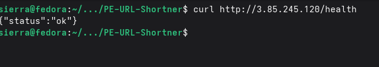

**The repository includes unit tests and pytest collection succeeds.**
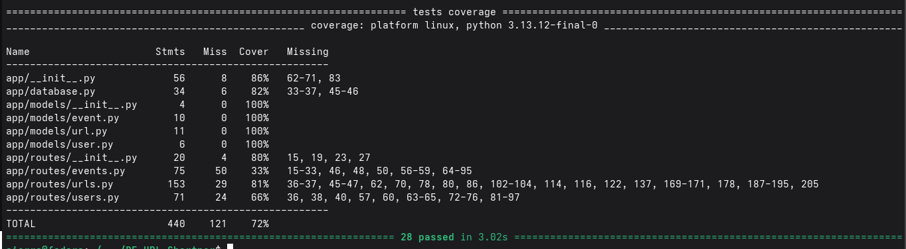

**CI workflow is configured to execute tests automatically.**
→ https://github.com/lewisawe/PE-URL-Shortner/actions

### Silver

**Automated test coverage reaches at least 50%.**

**Integration/API tests exist and are detectable.**
→ https://github.com/lewisawe/PE-URL-Shortner/blob/main/tests/test_urls.py

**Error handling behavior for failures is documented.**
→ https://github.com/lewisawe/PE-URL-Shortner/blob/main/docs/FAILURE_MODES.md

### Gold

**Automated test coverage reaches at least 70%.**

**Invalid input paths return clean structured errors.**
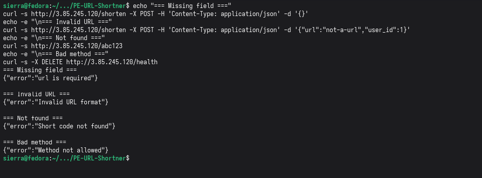

**Evidence shows service restart behavior after forced failure.**
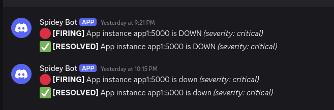

**Failure modes and recovery expectations are documented.**
→ https://github.com/lewisawe/PE-URL-Shortner/blob/main/docs/FAILURE_MODES.md

---

## 🚀 Scalability

### Bronze

**k6 or Locust tooling is configured for load testing.**
→ https://github.com/lewisawe/PE-URL-Shortner/blob/main/load_test.js

**Evidence demonstrates load testing at 50 concurrent users.**
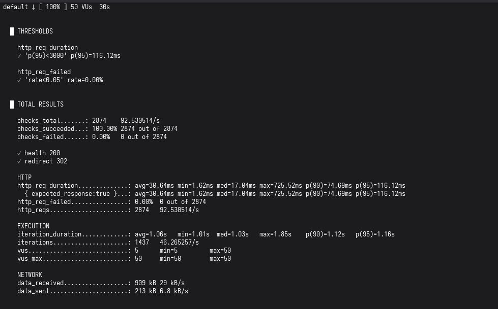

**Baseline p95 latency and error rate are documented.**
→ https://github.com/lewisawe/PE-URL-Shortner/blob/main/docs/CAPACITY_PLAN.md

### Silver

**Evidence demonstrates successful load at 200 concurrent users.**
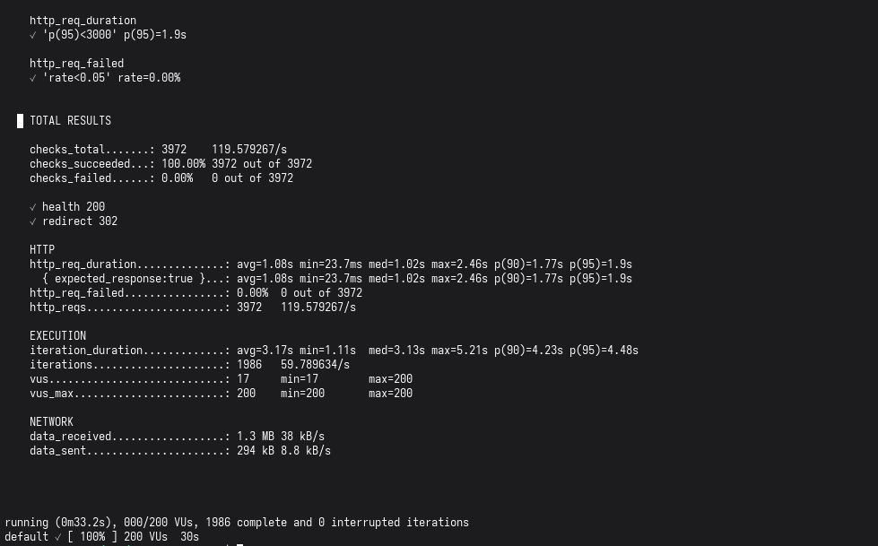

**Docker Compose configuration includes multiple app instances.**
→ https://github.com/lewisawe/PE-URL-Shortner/blob/main/docker-compose.yml

**Load balancer configuration is present for traffic distribution.**
→ https://github.com/lewisawe/PE-URL-Shortner/blob/main/nginx.conf

**Evidence shows response times remain under 3 seconds at scale-out load.**

### Gold

**Evidence demonstrates tsunami-level throughput.**
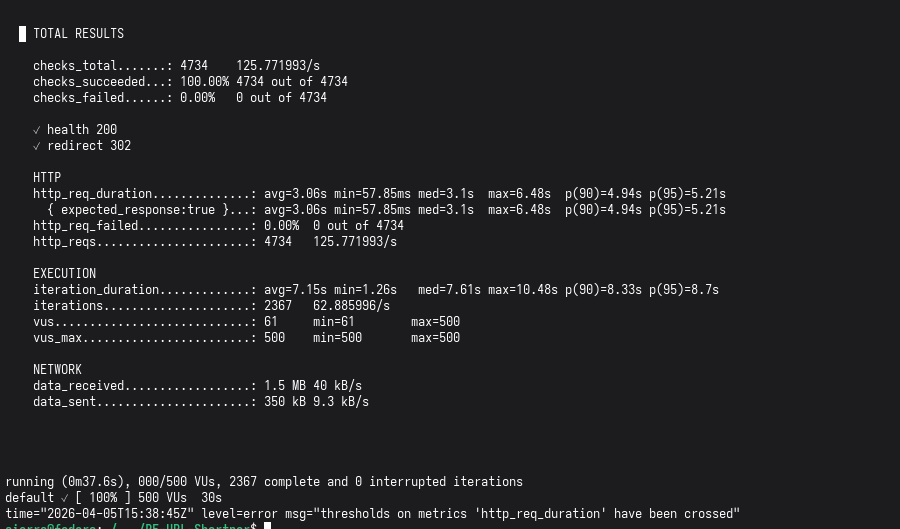

**Repository/configuration shows Redis caching implementation.**
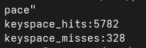

**A bottleneck analysis report is documented.**
→ https://github.com/lewisawe/PE-URL-Shortner/blob/main/docs/BOTTLENECK_REPORT.md

**Evidence shows error rate remains below 5% during high load.**

---

## 🚨 Incident Response

### Bronze

**JSON structured logging includes timestamp and log level fields.**
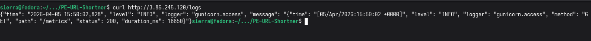

**A /metrics-style endpoint is available and returns monitoring data.**
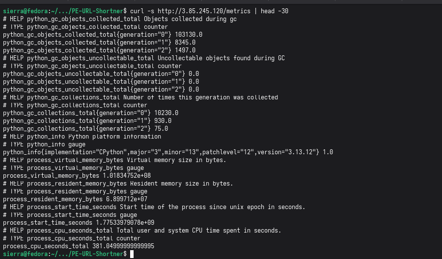

**Logs can be inspected through tooling without direct server SSH.**

### Silver

**Alerting rules are configured for service down and high error rate.**
→ https://github.com/lewisawe/PE-URL-Shortner/blob/main/alerts.yml

**Alerts are routed to an operator channel such as Slack or email.**

**Alerting latency is documented and meets five-minute response objective.**
→ https://github.com/lewisawe/PE-URL-Shortner/blob/main/docs/RUNBOOK.md

### Gold

**Dashboard evidence covers latency, traffic, errors, and saturation.**
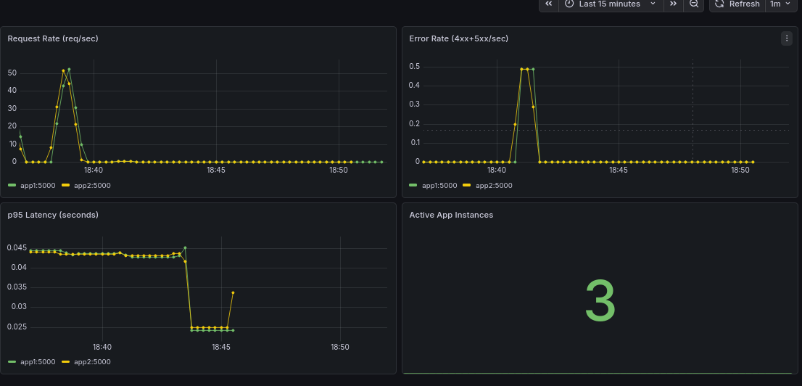

**Runbook includes actionable alert-response procedures.**
→ https://github.com/lewisawe/PE-URL-Shortner/blob/main/docs/RUNBOOK.md

**Root-cause analysis of a simulated incident is documented.**
→ https://github.com/lewisawe/PE-URL-Shortner/blob/main/docs/INCIDENT_REPORT.md

---

## 📜 Documentation

### Bronze
- [README](https://github.com/lewisawe/PE-URL-Shortner/blob/main/README.md)
- [API Docs](https://github.com/lewisawe/PE-URL-Shortner/blob/main/docs/API.md)

### Silver
- [Deploy Guide](https://github.com/lewisawe/PE-URL-Shortner/blob/main/docs/DEPLOY.md)
- [Troubleshooting](https://github.com/lewisawe/PE-URL-Shortner/blob/main/docs/FAILURE_MODES.md)
- [Env Vars](https://github.com/lewisawe/PE-URL-Shortner/blob/main/.env.example)

### Gold
- [Runbook](https://github.com/lewisawe/PE-URL-Shortner/blob/main/docs/RUNBOOK.md)
- [Decision Log](https://github.com/lewisawe/PE-URL-Shortner/blob/main/docs/DECISION_LOG.md)
- [Capacity Plan](https://github.com/lewisawe/PE-URL-Shortner/blob/main/docs/CAPACITY_PLAN.md)
